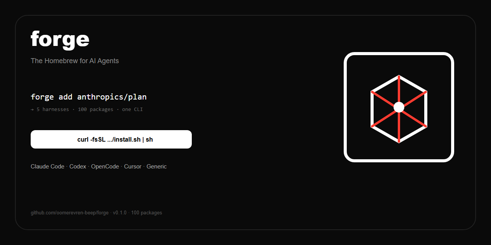

# Forge — The Homebrew for AI Agents

[](https://github.com/oomerevren-beep/forge/actions)
[](https://www.npmjs.com/package/tryforge)
[](https://www.npmjs.com/package/tryforge)
[](LICENSE)
[](registry/index.json)
[](https://github.com/oomerevren-beep/forge)

> **One CLI to install skills, MCPs, plugins, agents on any harness.**

`brew` is for system packages. `forge` is for AI agent packages. One command, every harness — no more `git clone + cp SKILL.md` four times for four tools.

```bash
# macOS / Linux
curl -fsSL https://raw.githubusercontent.com/oomerevren-beep/forge/main/install.sh | sh
# Windows PowerShell
irm https://raw.githubusercontent.com/oomerevren-beep/forge/main/install.ps1 | iex
# or, with Node 18+
npm i -g tryforge
```

```bash
forge doctor                # detect your harnesses
forge add anthropics/plan   # skill → all 7 harnesses at once
forge add mcp/filesystem    # MCP server → auto mcp.json
```

**Star to get notified at v1.0** — questions in [Discussions](https://github.com/oomerevren-beep/forge/discussions).

<p align="center">
  
</p>
<p align="center">
  
  <br><em>7-second wow: <code>forge doctor → search → add → list</code></em>
</p>

---

## Table of Contents

- [Why Forge?](#why-forge)
- [Features](#features)
- [Install](#install)
- [Quick Start](#quick-start)
- [Team Sync — `forge install`](#team-sync--forge-install)
- [Create a Package](#create-a-package)
- [How it Works](#how-it-works)
- [Comparison](#comparison)
- [Registry — 250 Packages](#registry--250-packages)
- [Architecture](#architecture)
- [Docs](#docs)
- [Roadmap](#roadmap)
- [Contributing](#contributing)
- [FAQ](#faq)
- [License](#license)

---

## Why Forge?

2026: everything is a skill, plugin, or MCP — but installing one is still stone age. Every harness has its own folder, no versioning, no update path.

- `obra/superpowers` — **~280k stars** — install is still manual `git clone + cp`
- `deepseek-harness` — **~208k stars, ~2 days to 100k** — proved "Everything is a Plugin", but DeepSeek-only
- `anthropics/skills` — **~173k stars** — Claude-only
- `mcp-registry` — MCP-only, no skills or agents

Result: a developer using Claude Code + Codex + OpenCode + Cursor installs the **same package 4 times by hand**. No `update`, no `forge.toml`, no team sync.

**Forge fixes it:** 6 package types × 7 harnesses × one CLI. Like `brew` unified system packages, `forge` unifies agent packages. Viral loop: creators promote `forge add me` to distribute their own work.

| Type | Example | What it does |
|------|---------|--------------|
| `skill` | `anthropics/plan` | `SKILL.md` capability (Anthropic standard) |
| `mcp` | `mcp/filesystem` | Model Context Protocol server |
| `plugin` | `dsh/desktop` | Harness extension |
| `agent` | `agency/frontend` | Subagent definition |
| `command` | `cmd/plan` | Slash command `/plan` |
| `hook` | `hook/pre-tool` | Lifecycle hook |

---

## Features

- **Universal — 6 types, one registry.** Skills + MCPs + plugins + agents + commands + hooks in one place.
- **Multi-harness — 7 adapters today.** One file per harness, so adding Antigravity, Droid, or Copilot is a single PR. Symlink (junction on Windows) preferred, copy fallback.
- **Team sync — `forge.toml` + `forge.lock`.** Like `package.json` for agents. `forge install` / `forge install --frozen` for CI.
- **Search in <200ms.** Offline scored `search.json` + typed index, no API key.
- **Git-native registry.** Every package is a GitHub repo. Forkable, private registry ready. No central DB.
- **Safe by default.** `sha256`-verified tarballs or hard fail (no silent fallback); mock content only with explicit `--mock`; `forge audit` flags unverified installs; `forge doctor` health check; Windows/Linux/macOS.

Supported harnesses (`forge doctor` detects all of them):

| Harness | Status |
|---------|:------:|
| Claude Code | ✅ |
| Codex | ✅ |
| OpenCode | ✅ |
| Cursor | ✅ |
| DeepSeek (dsh) | ⚠️ (community/untested) |
| Windsurf | ✅ |
| Generic (any other) | ✅ |

---

## Install

```bash
# macOS / Linux
curl -fsSL https://raw.githubusercontent.com/oomerevren-beep/forge/main/install.sh | sh

# Windows PowerShell
irm https://raw.githubusercontent.com/oomerevren-beep/forge/main/install.ps1 | iex

# via npm (Node 22+)
npm i -g tryforge
```

Requires Node 18+ for v0.1 (TypeScript). Rust binary in v0.2 — single binary, no runtime. Details and troubleshooting: [docs/INSTALL.md](docs/INSTALL.md).

---

## Quick Start

60 seconds, copy-paste:

```bash
npm i -g tryforge          # or: curl -fsSL https://raw.githubusercontent.com/oomerevren-beep/forge/main/install.sh | sh
forge doctor              # detect your harnesses (7 checked)
forge add anthropics/plan # install latest → all harnesses at once
```

More once you're in:

```bash
forge search plan         # find packages (try: pdf, mcp, agent)
forge list                # installed, with versions
forge info mcp/github     # detail + versions + engines
forge outdated            # what can be updated
forge update              # update all (or: forge update mcp/github)
forge remove obra/superpowers
```

```bash
# version pinning
forge add anthropics/plan@1.1.0
forge add anthropics/plan@^1.2.0

# dry run — see what would happen
forge add anthropics/plan --dry-run

# mock content for packages with no verified tarball yet (explicit opt-in)
forge add skill/pdf --mock
forge install --mock       # same opt-in for project installs
forge update mcp/github --mock
```

---

## Team Sync — `forge install`

Add `forge.toml` to your project, everyone gets the same set with one command.

```toml
# my-project/forge.toml
[project]
name = "my-app"
version = "0.1.0"

[dependencies]
"anthropics/plan" = "^1.2.0"
"mcp/filesystem" = "^1.0.0"
"obra/superpowers" = "^3.0.0"
"skill/pdf" = "^1.0.0"
```

```bash
forge install          # installs all, writes forge.lock
forge install --frozen # CI: exact versions from lock (like npm ci)
forge outdated         # shows 1.1.0 → 1.2.0 etc.
forge update           # bumps to latest within semver
```

Lockfile `forge.lock` is `[[packages]]` TOML — commit it. `~/.forge/config.toml` holds user defaults (registry URL, default harnesses). Worked example: [examples/team-sync/](examples/team-sync/).

---

## Create a Package

```bash
forge init my-skill --type skill --yes   # → SKILL.md + forge.toml
forge init my-mcp --type mcp --yes       # → MCP template + [mcp] config
forge init my-agent --type agent --yes   # → agent.md template
# types: skill | mcp | plugin | agent | command | hook

cat forge.toml
# [package] name="my-skill" version="0.1.0" type="skill" ...

forge publish   # (v0.2) validates → tarball → GitHub Release → registry PR
```

Until `publish` lands, open a PR adding `registry/packages/<slug>.json` (see `schema/forge.schema.json`), then `npm run registry:build`. Minimal working example: [examples/minimal-skill/](examples/minimal-skill/).

---

## How it Works

```
forge add anthropics/plan
  → resolve ^1.2.0 → tarball URL + sha256 (from local/bundled registry/index.json; CDN in v0.3)
  → download to ~/.forge/cache/tarballs/ → verify sha256 (hard fail on mismatch) → extract to ~/.forge/packages/anthropics-plan@1.2.0/
  → adapter: symlink/copy to all 7 harnesses (Claude/Codex/OpenCode/Cursor/DSH/Windsurf/Generic)
  → if MCP: backup mcp.json → inject server entry
```

Add a harness = one file in `cli/src/adapters/`. See `docs/ADAPTERS.md`.

```
~/.forge/
  config.toml               # user config
  packages/<slug>@<ver>/    # extracted content
  cache/tarballs/           # downloaded .tar.gz
  links.json                # {pkg, version, adapters[]} source of truth
```

---

## Comparison

|  | **Forge** | `anthropics/skills` | `DSH` | `mcp-registry` | Manual `git clone` |
|---|---|---|---|---|---|
| Types | **6** (skill/mcp/plugin/agent/command/hook) | 1 (skill) | plugin | 1 (mcp) | 1 |
| Harnesses | **7** (Claude/Codex/OpenCode/Cursor/DSH/Windsurf/Generic) | 1 | 1 (DeepSeek) | ~1 | per-harness manual |
| Versioning | **semver + lock** | none | none | partial | none |
| Update | `forge update` | manual | manual | manual | manual |
| Team sync | **`forge.toml` + `forge.lock`** | none | none | none | none |
| Search | `<200ms` offline | GitHub search | none | web only | none |
| Registry | **Git-native, forkable** | repo | repo | central | — |

Narrow tools fragment. Universal wins — same lesson as `brew`.

---

## Registry — 250 Packages

Seeded at v0.1, grown in Faz 13-lite — `registry/packages/*.json` → `registry/index.json` + `search.json` + `stats.json`.

```bash
forge search mcp        # 54 results
forge search pdf        # 13 results
forge search --type skill plan  # filtered
forge info skill/pdf    # versions, engines, sha
```

Stats: **127 skills, 54 MCPs, 33 agents, 15 commands, 10 hooks, 11 plugins.** Generated via:

```bash
npm run seed            # idempotent: base catalog (100) + Faz 13-lite (+150)
npm run registry:build  # index + search + stats + --check in CI
```

Publish flow (v0.2): `forge publish` → GitHub Release → PR to `registry/packages/` → bot merges → R2 deploy.

See `docs/REGISTRY.md` and `docs/SPEC.md`.

---

## Architecture

```
CLI (TypeScript v0.1 → Rust v0.2)
  ├─ registry client (index.json + semver)
  ├─ store (~/.forge/packages/ + links.json + cache)
  ├─ adapters (detect/install/list — 1 file per harness)
  └─ commands (add/remove/list/search/info/doctor/init/install/update/outdated/audit)
```

Full diagram and crate layout in `docs/ARCHITECTURE.md`. Tech choices: `commander` + `smol-toml` + `tsx` (no `bun` on Windows), `tsc` emit to `dist/` for `npm pack`.

---

## Docs

- [Install](docs/INSTALL.md) — npm / curl / source, verification
- [Examples](examples/) — minimal skill + team sync, copy-paste
- [Vision](docs/VISION.md) — why now, why 100k
- [PRD](docs/PRD.md) — users, stories, commands, harness matrix
- [Architecture](docs/ARCHITECTURE.md) — components, security, perf
- [Package Spec](docs/SPEC.md) — `forge.toml` fields per type
- [Registry](docs/REGISTRY.md) — index schema, publish, fork
- [Adapters](docs/ADAPTERS.md) — add a harness in one file
- [Roadmap](docs/ROADMAP.md) — v0.1 → v1.0
- [Changelog](CHANGELOG.md) — release history

---

## Roadmap

**v0.1 — Homebrew moment** (now): 7 harnesses, 250 packages, `add/search/list/doctor/install/init` — Trending prep.
**v0.2 — NPM moment**: `forge publish`, deps, `cargo install`.
**v0.3 — Store moment**: `forge run`, Rust binary, GUI.
**v1.0 — Cloud**: team registry, `brew install forge`, `winget`.

See `docs/ROADMAP.md`.

---

## Contributing

```bash
git clone https://github.com/oomerevren-beep/forge
cd forge
npm install
npm run build
npm test                  # 35 tests (smoke + semver + init + adapters + installer-security)
npm run dev -- --help     # or: npx tsx cli/src/index.ts --help
```

- Add a package: create `registry/packages/<slug>.json` → `npm run registry:build`
- Add a harness: `cli/src/adapters/<name>.ts` → register in `adapters/index.ts` → `forge doctor`
- PR checklist: `npm run build && npm test && npm run registry:build -- --check`
- New? Start with [`good first issue`](https://github.com/oomerevren-beep/forge/issues?q=is%3Aissue+is%3Aopen+label%3A%22good+first+issue%22) — questions in [Discussions](https://github.com/oomerevren-beep/forge/discussions)

See `CONTRIBUTING.md`, [Code of Conduct](CODE_OF_CONDUCT.md), [Security](SECURITY.md) and `AGENTS.md`.

---

## FAQ

**Is this just for Claude Code?**
No. 7 harnesses today, one file per new harness. The point is *universal* — same reason `brew` beat per-OS managers.

**How is this different from `mcp-registry` or `skills` repos?**
Those are single-type and single-harness. Forge is `brew` for *all* agent package types, on *every* harness, with versioning/lock/search.

**Does `install.sh` need `forge.sh` domain?**
No. `curl -fsSL https://raw.githubusercontent.com/oomerevren-beep/forge/main/install.sh | sh` works today. `forge.sh` is a future vanity alias.

**Are most packages mock content?**
Honest answer: 245 of 250 registry entries still carry placeholder SHAs (only 5 verified so far). Forge is fail-closed — installing one without `--mock` errors out instead of silently faking it; `forge audit` flags every unverified install. Real tarballs land as maintainers verify them (tracked for Faz 13-full).

**Windows symlinks?**
Junction (`symlinkSync(..., 'junction')`) on dirs, fallback to `cpSync` on `EPERM`. `doctor` checks `links.json` (source of truth), not just dir scan.

**Why TypeScript first, not Rust?**
Speed to market. v0.1 is TypeScript + `tsx`; v0.2 rewrites to Rust for single binary `cargo install`. Adapters stay cheap.

**Private registry?**
Yes. Fork this repo, keep `registry/` private, point `~/.forge/config.toml` `registry = "https://your-r2/index.json"`.

---

## License

MIT — see [LICENSE](LICENSE).

---

<p align="center">
  <strong>Star this repo to get notified at launch. 250 packages are live at <a href="https://github.com/oomerevren-beep/forge/releases/tag/v0.1.1">v0.1.1</a>.</strong><br>
  <code>forge add</code> → 7 places at once. <code>forge install</code> → team sync. Homebrew simple.
</p>
